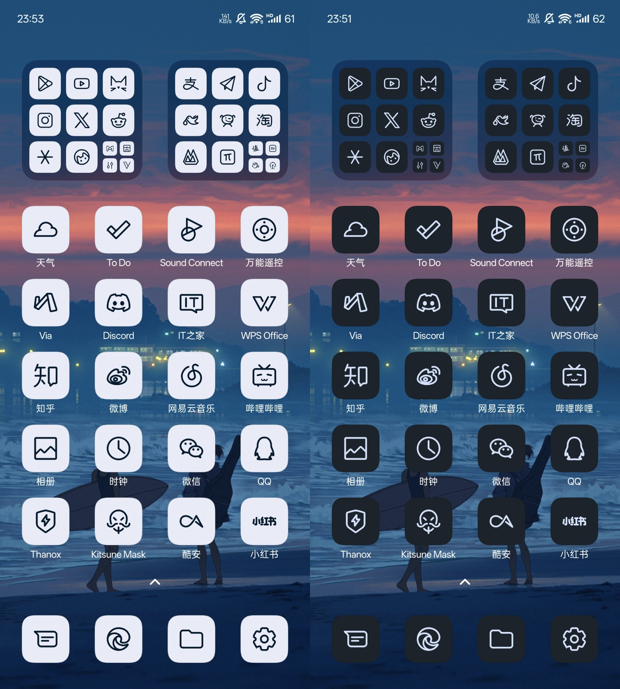
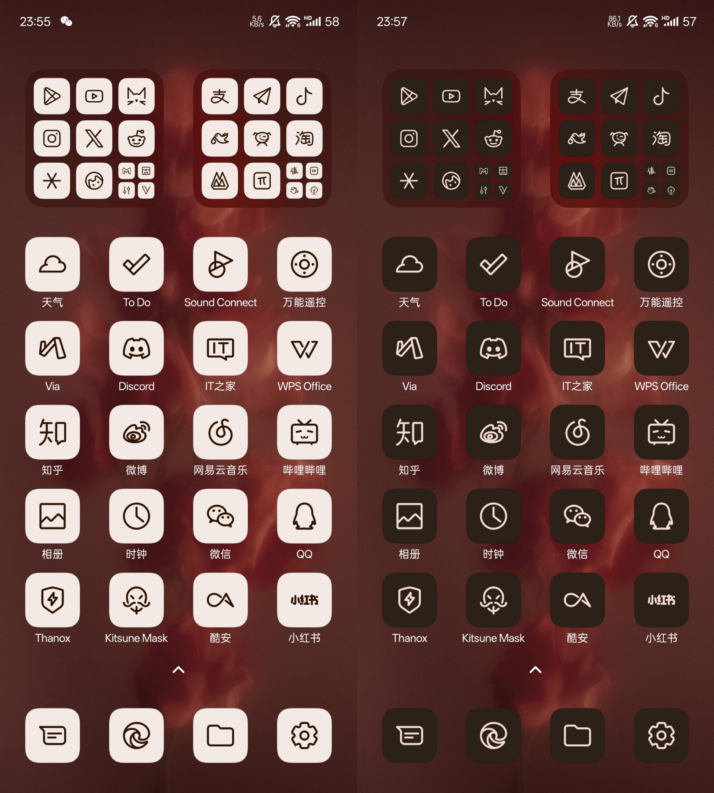
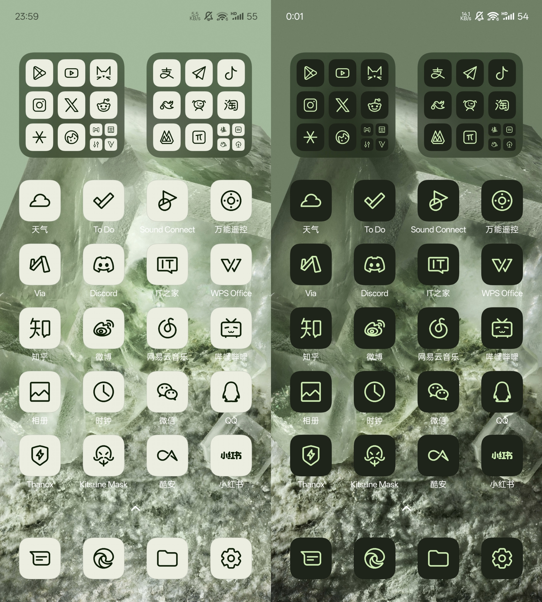
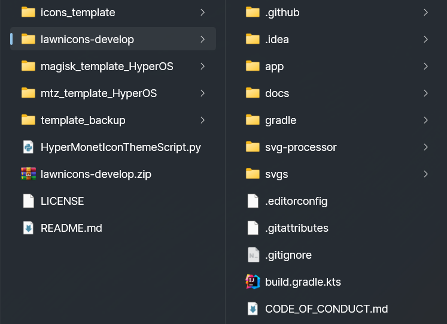
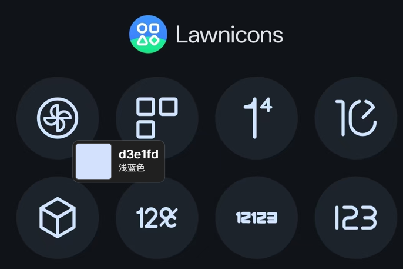
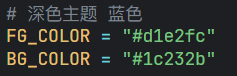

# HyperMonetIconTheme

[](https://hits.sh/github.com/VincentAzz/HyperMonetIconTheme-visited/)


## 🤔 这是什么
由于HyperOS缺乏完整的Material You Monet图标支持，还限制了替换桌面图标的途径，无法使用第三方图标包，使其不能优雅的体验Monet单色图标

[Lawnicons](https://github.com/LawnchairLauncher/lawnicons) 是 Lawnchair 启动器团队开发的一个支持 Monet 动态配色特性的图标包，国内App支持度较好，图标更新频繁

本项目通过编写Python脚本将Lawnicons仓库中的svg图标处理后移植到适用于HyperOS的Magisk模块中，尝试实现类似的Monet图标效果，且可自定义颜色。

尽管它没法真正实现端侧莫奈动态配色，但看起来效果确实优雅，和原始的莫奈图标难分秋毫🙂。而且实现思路也不太复杂
> [!NOTE] 
> 需要root

<br/>

## 🥳 使用效果
Xiaomi13 | HyperOS2 | Android15 | Kitsune Mask 27001



<br/>


<br/>


<br/>

## 🛠️ 工作原理
不论是Magisk模块还是mtz主题包，MIUI/HyperOS的图标主题核心都在于其中包含的icons文件，其本质是一个去掉后缀的zip包，用来存放图标资源

icons包结构如下：

```
icons/
  ├─ transform_config.xml
  └─ res/
      └─ drawable-xxhdpi/
            ├─ com.tencent.mm/
            │   ├─ 0.png
            │   └─ 1.png
            ├─ com.coolapk.market/
            │   ├─ 0.png
            │   └─ 1.png
            └─ ...

```
其中drawable-xxhdpi中存放以对应应用包名命名的目录，每个应用的静态分层图标以png图片形式存在，由背景0.png，图标本体1.png组成，不支持svg和drawable xml

Lawnicons 包含了大量用于生成动态配色图标的svg矢量图标，而svg文件可以通过cairosvg和pil库转换为png并着色

Lawnicons 还包含了图标-包名的映射文件appfilter.xml，这为生成以包名命名的目录提供了可能

但由于 Lawnicons 使用"包名/activity"而非仅包名来映射图标，一个包名下可能列举了多个activity，导致同一个包名或图标可能出现在多个映射条目中。需确保每个包名只出现一次，在对原始映射进行去重简化后，可以方便的进行映射

综上，脚本的工作流程大致如下：
1. 预先设定前景色和背景色
2. 去重 Lawnicons 的映射文件
3. 按背景色创建画布 0.png 作为背景复用
4. 将每一个 svg 图标转换成透明背景的 png，着前景色，调整大小与缩放，生成 1.png
5. 映射到包名并创建目录，放入对应 png
6. 打包 icons 文件
7. 合入 Magisk 模块模板，打包输出
8. 合入 mtz 主题模板，打包输出（可选）


<br/>

## 📖 如何使用
> 如果你不想动手，或不具备条件，亦或是先想看看效果，右侧 Release 和底部的123云盘链接均包含了上述效果预览中几种配色方案的Magisk模块。
>
> 123云盘中还包含了以下需要安装的依赖、本项目文件，以及最新的Lawnicons项目文件，方便下载慢的同学使用。

### 前提条件
- 确保你的 HyperOS 已经 root
- 你有一台 Windows 电脑
- 一个编辑器，例如 VSCode。当然用记事本也没关系
- 取色工具 (可选)，例如PowerToys、Photoshop、一个木函等

### 环境依赖

#### 1. Python 环境
- 安装 [Python 3.x](https://www.python.org/downloads/)
- 安装时务必记住勾选 "Add Python to Path"，将 Python 添加到环境变量

#### 2. Cairo 图形库
- 下载并安装包含了 Cairo 图形库的 [GTK For Windows Runtime](https://github.com/tschoonj/GTK-for-Windows-Runtime-Environment-Installer/releases/download/2022-01-04/gtk3-runtime-3.24.31-2022-01-04-ts-win64.exe)

#### 3. Python 依赖
- 安装 cairosvg 和 pillow。在终端中执行：
```bash
pip install cairosvg pillow
```


### 开始使用
#### 1. 克隆或下载本项目文件到本地，并解压
&nbsp;&nbsp;&nbsp;&nbsp;如何下载？找到页面上方的绿色Code按钮，Download ZIP
#### 2. 克隆或下载 [Lawnicons develop 分支](https://github.com/LawnchairLauncher/lawnicons) 项目文件到本地，并解压到 lawnicons-develop。(下载项目文件，而不是 Release 中的 apk 或 Source code)
> 如需应用 Lawnicons 图标更新，需重新克隆或下载完整的Lawnicons develop 分支文件并再次运行
> 
> 可查看 Lawnicons 图标 [提交记录](https://github.com/LawnchairLauncher/lawnicons/commits/develop/) 跟踪更新
#### 3. 将 lawnicons-develop 目录置于本项目目录下，确保 lawnicons-develop 下不存在更进一步的嵌套目录
&nbsp;&nbsp;&nbsp;&nbsp;应当看起来如下

&nbsp;&nbsp;&nbsp;&nbsp;


#### 4. 基于壁纸获取前景色和背景色

&nbsp;&nbsp;&nbsp;&nbsp;Monet 图标分为前景色和背景色。前景色 FG_COLOR 用作图标线条颜色，背景色 BG_COLOR 用作图标背景底色

&nbsp;&nbsp;&nbsp;&nbsp;通常在亮色模式下，前景色是深色，背景色是浅色；在暗色模式下，前景色是浅色，背景色是深色

&nbsp;&nbsp;&nbsp;&nbsp;有多种方式获取颜色，但似乎都不太优雅


- &nbsp;&nbsp;&nbsp;&nbsp;方式1：安装任意版本的 [Lawnicons](https://github.com/LawnchairLauncher/lawnicons/releases/download/v2.12.0/Lawnicons.2.12.0.apk)，直接截图取色。以获得与 Lawnicons 完全相同的效果

&nbsp;&nbsp;&nbsp;&nbsp;通过取色器选取图标线条 FG_COLOR，选取图标背景颜色 BG_COLOR，例如，下图中获取的是暗色模式下 Lawnicons 图标的前景色。

&nbsp;&nbsp;&nbsp;&nbsp;


- &nbsp;&nbsp;&nbsp;&nbsp;方式2：将壁纸上传到 [Material Theme Builder](https://material-foundation.github.io/material-theme-builder/)，以获得完整的 Material You 配色方案 

如欲创建深色模式下使用的图标，可在页面右侧下方的 Light Scheme 中选取 (Primary 或 Secondary) Container 即 P-90 或 S-90 作为 FG_COLOR，On (Primary 或 Secondary) Container 即 P-10 或 S-10 作为 BG_COLOR。

&nbsp;&nbsp;&nbsp;&nbsp;

如欲创建浅色模式下使用的图标，可在页面右侧下方的 Dark Scheme 中选取 (Primary 或 Secondary) Container 即 P-30 或 S-30 作为 FG_COLOR，On (Primary 或 Secondary) Container 即 P-90 或 S-90 作为 BG_COLOR。

&nbsp;&nbsp;&nbsp;&nbsp;

也可根据个人喜好搭配色彩、深浅和对比度

#### 5. 编辑HyperMonetIconThemeScript.py

&nbsp;&nbsp;&nbsp;&nbsp;修改22-23行的 FG_COLOR 和 BG_COLOR，或使用下方预设的几种色彩。按需修改线程数、图标大小等其他参数并保存。建议阅读相关注释

&nbsp;&nbsp;&nbsp;&nbsp;

&nbsp;&nbsp;&nbsp;&nbsp;其中 544-547行 main方法中打包mtz主题包的调用已被注释，默认不导出mtz，可自行启用。

&nbsp;&nbsp;&nbsp;&nbsp;由于mtz存在动画和圆角问题，且无高级材质，不再建议使用mtz主题包。务必优先使用Magisk模块

#### 6. 在当前目录下运行 HyperMonetIconThemeScript.py

&nbsp;&nbsp;&nbsp;&nbsp;在终端或编辑器中执行
```bash
python HyperMonetIconThemeScript.py
```
&nbsp;&nbsp;&nbsp;&nbsp;由于需要处理大量图标，运行耗时取决于CPU性能，大约需要5分钟

#### 7.如果一切正常，运行结束后 Magisk 模块和 mtz 主题包（如有）将输出至当前目录下

#### 8.拷贝模块至手机，刷入并重启即可应用。


<br/>

## ⚗️ 兼容性

兼容性取决于icons模板的transform_config、图标大小与缩放、不同系统对图标的裁切等

已在 Xiaomi 13: HyperOS 2.0.17 + Kitsune Mask 27001 上测试，目前一切正常

理论上 HyperOS1 也能使用。MIUI14可能存在动画圆角遮罩问题

其他系统版本、其他分辨率机型待测试补充

<br/>

## 📝 Todos

桌面快捷方式，例如一键锁屏等图标尚未处理


<br/>

## 🙋‍♀️ 提交图标

请向上游 Lawnicons 提交 svg 图标

图标规则与提交向导 https://github.com/LawnchairLauncher/lawnicons/blob/develop/CONTRIBUTING.md

<br/>

## 🥰 链接和资源

金山文档：https://kdocs.cn/l/clkGhVnsW7p1

123云盘：https://www.123684.com/s/ILmbVv-AtvTH
